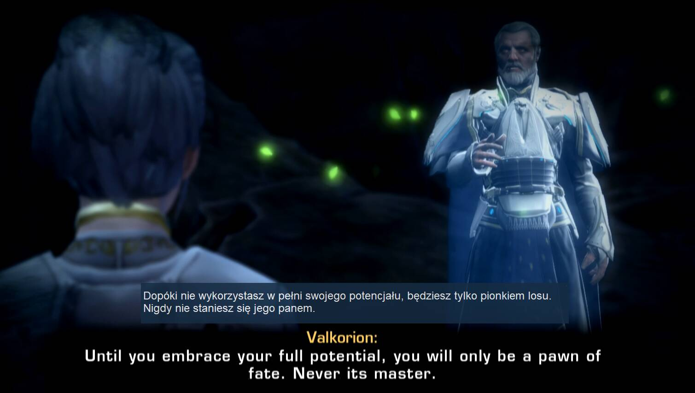
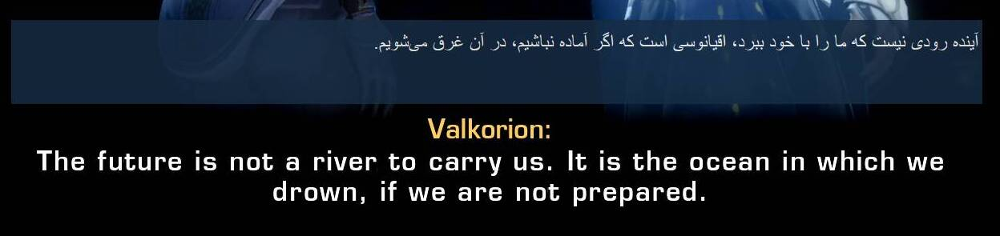
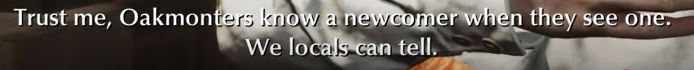
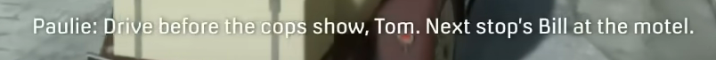

# Game-Changing Translator
Copyright © 2025 Tomasz Kamiński



## 🌟 **[✨ Visit Our Home Page ✨](https://tomkam1702.github.io/OCR-Translator/)**
**Discover why this is the world's first AI-OCR game translator with our comprehensive showcase featuring a video clip, competitive comparisons, and and all the innovative features!** 🚀

## Overview

Game-Changing Translator is a powerful desktop application that automatically captures text from any area of your screen, performs optical character recognition (OCR), and translates the text in real-time. It creates floating overlay windows that can be positioned anywhere on your screen, making it perfect for translating games, videos, PDFs, or any application with text that you can't easily copy and paste.

This project was inspired by a family member who was learning French by playing games with French subtitles and needed real-time translation. I hope it will be useful both for gamers and non-gamers alike for casual on-screen translations, whether you're learning a new language through entertainment or simply need to understand content in a foreign language.

This application was developed or rather vibe-coded with the support of the following AI models: Claude 3.7 Sonnet, Claude Sonnet 4 and Gemini 2.5 Pro.

## Game-Changing Translator Gallery
  - [English](https://tomkam1702.github.io/OCR-Translator/docs/gallery.html)
  - [Polish](https://tomkam1702.github.io/OCR-Translator/docs/gallery_pl.html)

## 🎬 **See the Magic in Action!**

### 🎮 Featured Game Demonstrations

<div align="center">
  <table>
    <tr>
      <td align="center" width="33%">
        <a href="https://youtu.be/0bMoL1pR7tM">
          
        </a>
        <br>
        <strong>🧙‍♂️ <a href="https://youtu.be/0bMoL1pR7tM">The Witcher 3</a></strong>
        <br>
        <em>Revolutionary AI OCR & natural Polish-to-English translation</em>
      </td>
      <td align="center" width="33%">
        <a href="https://youtu.be/Iy4bIr06Ae4">
          
        </a>
        <br>
        <strong>⚔️ <a href="https://youtu.be/Iy4bIr06Ae4">Kingdom Come: Deliverance II</a></strong>
        <br>
        <em>Czech-to-English Translation</em>
      </td>
      <td align="center" width="33%">
        <a href="https://youtu.be/rCsfY6Zsmps">
          
        </a>
        <br>
        <strong>🌌 <a href="https://youtu.be/rCsfY6Zsmps">Star Wars: The Old Republic</a></strong>
        <br>
        <em>French-to-English Translation</em>
      </td>
    </tr>
  </table>
</div>

### 🚀 What These Demos Showcase:

- **✨ Gemini AI OCR Technology** handling complex backgrounds and stylised fonts that break traditional OCR engines
- **🧠 Context-aware translation** maintaining narrative coherence across different game dialogues  
- **⚡ Real-time performance** with floating overlays that work seamlessly over any game interface
- **🎯 Superior accuracy** where competitors fail on challenging subtitle scenarios
- **🌍 Multi-language support** demonstrating various language pairs in gaming contexts

*Experience the world's first AI-OCR game translator that actually works with difficult gaming content across multiple game genres!*

---

## Key Features

### 🚀 NEW in Version 3.8.0
- **✨ Hover Translation Mode**: Translate text on-demand by simply hovering your mouse over a source area.
- **🖱️ Click-Through Overlays**: Make overlay windows transparent to mouse clicks, allowing interaction with underlying game or application elements.
- **📋 Context Menu**: Right-click on the translation overlay to quickly **Copy** the text or have it **Read Aloud** using a text-to-speech engine.

### 🚀 NEW in Version 3.7.0
- **🎯 DeepL Translation with Context - A Game-Changing First!** 🌟: Revolutionary context-aware DeepL translation that intelligently remembers up to 3 previous subtitles for **dramatically improved grammar, accuracy, and natural conversational flow** ✨
  - 🎁 **Completely FREE Feature** - Context usage **doesn't count** towards DeepL's character limits! Unlimited context-aware translations at no extra cost 💰
  - 📊 Dedicated logging system in `DeepL_Translation_Long_Log.txt` for detailed translation tracking and quality verification
  - 🎮 Perfect for dialogue-heavy games and narrative content where pronouns, grammatical agreement and meaning depend on previous context
- **Updated Gemini Model Support**: Latest Gemini models with enhanced performance characteristics
  - `Gemini 2.5 Flash` (gemini-2.5-flash-preview-09-2025): Good translation quality with lower latency
  - `Gemini 2.5 Flash-Lite` (gemini-2.5-flash-lite-preview-09-2025): Optimised for OCR operations with reduced latency
  - However, `Gemini 2.0 Flash` remains the recommended choice for translation quality with more than six times lower output cost than Gemini 2.5 Flash
- **Experimental Line Break Preservation**: Optional feature to maintain original line breaks in OCR and translation
  - Works best with Gemini models for consistent results
  - Less reliable with GPT models and DeepL
  - Useful for specific dialogue scenes but recommended to keep disabled for most scenarios

### 🚀 NEW in Version 3.6.0
- ** OpenAI Integration - More Choice, More Power!**: The application now includes support for OpenAI's powerful language models, offering a flexible and high-quality alternative to existing AI services.
  - **Three Versatile Models**: Access to a curated selection of OpenAI's best models:
    - `GPT-5 Nano`
    - `GPT-4.1 Mini`
    - `GPT-4.1 Nano`
  - **Dual Functionality**: All supported OpenAI models can be used for both high-quality **Translation** and advanced, vision-capable **OCR**, giving you the freedom to choose the best tool for the job.
  
  
  
  *Experience the intuitive OpenAI integration interface - easily switch between models and configure both OCR and translation services with the same or different powerful API providers*
  
  - Be sure to check out the **comparison between OpenAI and Gemini models** in the updated [user manual](https://tomkam1702.github.io/OCR-Translator/docs/user-manual.html#openai-api-a-flexible-alternative).

### 🚀 NEW in Version 3.5.8

- **Auto-Update System**: Complete auto-update functionality accessible through "Check for Updates" button in the About tab
  - GitHub API integration for checking latest releases automatically
  - Simple one-click update process with progress tracking
  - Safe update application with user file preservation
  - Staging system for secure update downloads and installation
- **Enhanced Typography Customisation**: Target Window Font Type selection allowing users to choose any Windows system font for translation display
  - Expanded beyond the previous default Arial font limitation
  - Access to complete Windows font library for personalised translation appearance
  - Improved readability options to suit individual preferences and visual requirements
- **Advanced Opacity Controls**: Independent transparency management for translation windows
  - Separate background and text opacity sliders providing independent control (0.0 to 1.0 range)
  - Replaced previous fixed 0.85 opacity preset with flexible user-defined transparency levels
  - Enhanced visual integration allowing translation windows to blend seamlessly with any background content
- **Improved Subtitle Display**: Enhanced formatting of conversational subtitles with proper line breaks for better readability in dialog-heavy content
  - Previous format: `   - How are you? - Fine.    `  
  - New format with proper line separation:
    ```
        - How are you?
        - Fine.                 
    ```

### 🚀 NEW in Version 3.5.7

- **Persian Language Support**: Added comprehensive Persian language support to both Gemini API and Google Translate translation services
- **Right-to-Left (RTL) Text Processing**: Enhanced text display formatting for RTL languages with improved punctuation positioning and proper text flow

  
  
  
  *Experience seamless Persian subtitle translation with proper RTL text formatting - perfect for Persian media content and language learning*

### 🚀 NEW in Version 3.5.3

- **Multiple Gemini Models Available**: Flexible model selection for OCR and translation operations with dynamic configuration
  - **Gemini 2.5 Flash-Lite**: Recommended for speed - optimal for fast-changing subtitles (< 1 second display time)
  - **Gemini 2.0 Flash**: Recommended for quality - superior OCR accuracy and most idiomatic translations for longer subtitles (1+ seconds)
  - **Comprehensive OCR Testing**: Curious which models handle challenging subtitles most effectively and consistently?

    
    
    [View detailed test results](https://tomkam1702.github.io/OCR-Translator/docs/OCR%20Test/OCR_Gemini_Test.html) showing Gemini 2.0 models' superior accuracy across multilingual content
  - **Dynamic Model Configuration**: Models available for selection are controlled by `resources/gemini_models.csv` for easy customization
  - **Performance-Optimized Selection**: Choose different models for OCR vs translation based on your specific needs
- **Enhanced API Integration**: Migration from `google.generativeai` to `google.genai` library for improved performance and stability
- **Optimized Threading**: Enhanced OCR and translation thread performance for faster processing and reduced latency

### 🚀 NEW in Version 3.0.0

- **Gemini OCR - Premium Text Recognition**: Revolutionary AI-powered OCR that delivers exceptional accuracy for challenging subtitle scenarios where traditional OCR engines struggle
  - Superior OCR quality with outstanding cost-to-quality ratio using advanced Gemini models
  - **Challenging Screenshot Examples**: See the dramatic difference in quality:
  
    
    
    **Tesseract OCR Result:** `~ Trust me, OD tite WE loca mS`  
    **Gemini OCR Result:** `Trust me, Oakmonters know a newcomer when they see one. We locals can tell.`
    
    
    
    **Tesseract OCR Result:** `' Paulie: Driv: show, Tom. Next stop's Bi the motel. 7 jj ie`  
    **Gemini OCR Result:** `Paulie: Drive before the cops show, Tom. Next stop's Bill at the motel.`
  
  - **Professional Results**: Handles low-contrast text, stylized fonts, and dynamic backgrounds that confuse traditional OCR
  - **Cost-Effective Excellence**: ~$0.00004 per subtitle screenshot - 37.5 times cheaper than Google Cloud Vision API while delivering superior results
  - **Unique Gaming Translation Solution**: First-of-its-kind integration of premium AI OCR with real-time game subtitle translation
  - **Special Cost Estimation**: Dedicated API Usage tab with rough cost estimates and comprehensive usage monitoring
- **Extended Context Window**: Expanded sliding history window from 2 to 5 previous subtitles for enhanced translation quality
  - **Better Context Awareness**: Improved narrative coherence and grammatical consistency across longer conversations
  - **Enhanced Asian Language Support**: Extended context particularly beneficial for languages that rely heavily on contextual understanding

### Core Features

- **Screen Area Selection**: Define custom regions for text capture and translation display
- **Real-time Translation**: Automatically detects and translates text as it changes
- **Multiple Translation Engines**:
  - Gemini 2.5 Flash-Lite API
  - MarianMT (offline neural machine translation)
  - DeepL API
  - Google Translate API
- **Multilingual User Interface**: Full support for English, Polish, and Chinese interface languages
- **Floating Overlays**: Translucent, movable windows that stay on top of other applications
- **Customizable Appearance**: Adjust colours, fonts, and transparency
- **Image Preprocessing**: Various modes to improve OCR accuracy
- **Hotkey Support**: Control the application without switching windows
- **Translation Caching**: Reduce API calls and improve performance

## Ready-to-Use Compiled Version

**🎮 Perfect for Gamers and Non-Technical Users!**

If you want to start using Game-Changing Translator immediately without installing Python or dealing with dependencies, we've prepared a ready-to-use compiled version for you:

### Quick Start Options

**📥 [Download from Releases](https://github.com/tomkam1702/OCR-Translator/releases)**

1. Download both files.
2. Run the .exe installer file to unpack and install the application to your preferred folder.
3. Install [Tesseract OCR](https://github.com/UB-Mannheim/tesseract/wiki) (one-time requirement).
4. Launch the application by running `GameChangingTranslator.exe` from your installation folder.
5. Experience premium AI OCR and enhanced context translation! 🤖

### Need Help?

📖 **Installation Guides:**
- [English Installation Guide](https://tomkam1702.github.io/OCR-Translator/docs/installation.html)
- [Polish Installation Guide](https://tomkam1702.github.io/OCR-Translator/docs/installation_pl.html)

The compiled versions include everything you need - no Python installation required!

## Installation

### Prerequisites

- Windows operating system
- [Tesseract OCR](https://github.com/UB-Mannheim/tesseract/wiki) installed
- Python 3.7 or newer

### Setup

1. Clone this repository:
   ```
   git clone https://github.com/tomkam1702/OCR-Translator.git
   ```

2. Install required Python packages:
   ```
   pip install -r requirements.txt
   ```

3. Run the application:
   ```
   python main.py
   ```

For detailed installation instructions, see the [Installation Guide](https://tomkam1702.github.io/OCR-Translator/docs/installation.html).

## Quick Start

1. Launch the application
2. Click "Select Source Area (OCR)" and drag to select the text area you want to translate
3. Click "Select Target Area (Translation)" and drag to select where you want the translation to appear
4. Configure your preferred translation method in the Settings tab
5. Click "Start" to begin translation
6. Press the `~` key to toggle translation on/off

For more detailed usage instructions, see the [User Manual](https://tomkam1702.github.io/OCR-Translator/docs/user-manual.html).

## Documentation

- **User Manual** 
  - [English](https://tomkam1702.github.io/OCR-Translator/docs/user-manual.html) 
  - [Polish](https://tomkam1702.github.io/OCR-Translator/docs/user-manual_pl.html)
- **Installation Guide** 
  - [English](https://tomkam1702.github.io/OCR-Translator/docs/installation.html) 
  - [Polish](https://tomkam1702.github.io/OCR-Translator/docs/installation_pl.html)
- **Game-Changing Translator Gallery**
  - [English](https://tomkam1702.github.io/OCR-Translator/docs/gallery.html)
  - [Polish](https://tomkam1702.github.io/OCR-Translator/docs/gallery_pl.html)
- **Troubleshooting** 
  - [English](docs/troubleshooting.md)
- **Developer Guide** 
  - [English](docs/developer-guide.md)

## Development Status

This project is considered feature-complete. Small changes may or may not be made in the future, but generally no active development is planned. If you wish to add features or make changes, the best approach is to fork the repository and develop it further yourself.

## Licence

This project is free software, licensed under the GNU General Public Licence version 3 (GPLv3).

You can:
- Use the software for any purpose
- Change the software to suit your needs
- Share the software and your changes with others

This program is distributed in the hope that it will be useful, but WITHOUT ANY WARRANTY. See the [LICENCE](LICENSE) file for complete details.

## Acknowledgments

- [Tesseract OCR](https://github.com/tesseract-ocr/tesseract)
- [MarianMT](https://huggingface.co/docs/transformers/model_doc/marian)
- [Google Cloud Translation API](https://cloud.google.com/translate)
- [DeepL API](https://www.deepl.com/pro-api)
- Developed with the support of the following AI models: Claude 3.7 Sonnet, Claude Sonnet 4 and Gemini 2.5 Pro


## Contributing

Please note that this project is considered feature-complete. If you wish to make substantial changes, please consider forking the repository instead.

> **⚠️ FORKING NOTICE**: This project requires attribution to the original author. Please read [ATTRIBUTION.md](ATTRIBUTION.md) before forking or using this code.

[](https://www.gnu.org/licenses/gpl-3.0)
[](ATTRIBUTION.md)
[](https://github.com/tomkam1702)
